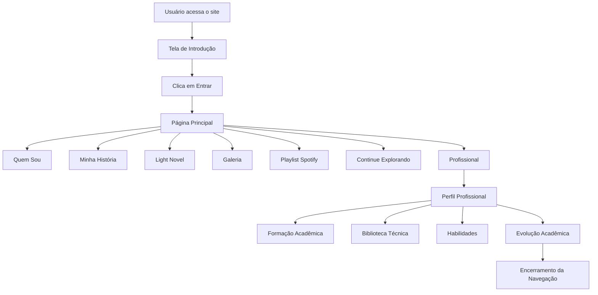
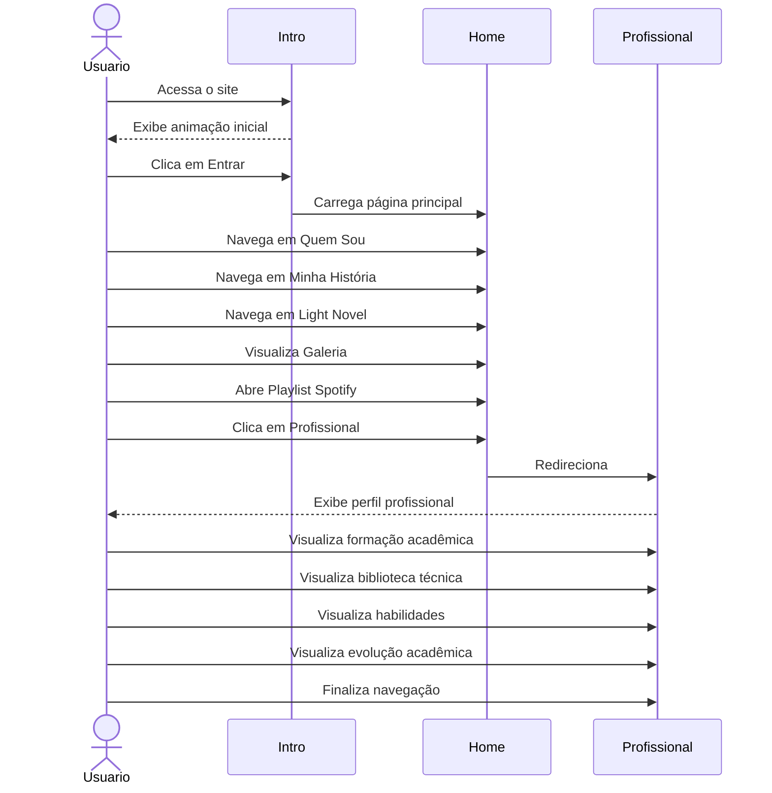

# 🌌 YURIVERSE

> Um universo digital que conecta minha identidade pessoal, meus interesses, minha trajetória acadêmica e meus projetos em um único lugar.

---

## 📖 Sobre o Projeto

O **YURIVERSE** é um site pessoal desenvolvido com **HTML5, CSS3 e JavaScript**, criado para apresentar quem eu sou além de um currículo tradicional.

A proposta é oferecer uma experiência imersiva onde visitantes podem conhecer:

- Minha história;
- Meus hobbies;
- Meus gostos musicais;
- Minha Light Novel;
- Minha trajetória acadêmica;
- Minha evolução pessoal e profissional;
- Livros que influenciaram minha jornada.

O projeto é totalmente estático e acessível pela web, sem autenticação ou sistema de banco de dados.

---

# 🎯 Objetivos

- Compartilhar minha história.
- Centralizar informações pessoais e profissionais.
- Divulgar minha Light Novel.
- Organizar minhas leituras técnicas.
- Demonstrar conhecimentos em desenvolvimento front-end.
- Criar uma experiência visual única para visitantes.

---

# 🛠 Tecnologias Utilizadas

## Front-End

- HTML5
- CSS3
- JavaScript (Vanilla JS)

## Recursos

- Animações CSS
- Transições JavaScript
- Design Responsivo
- Integração com Spotify
- Galeria de Imagens
- Reprodução de Áudio

---

# 📂 Estrutura do Projeto

```text
YURIVERSE/
│
├── assets/
│   ├── audio/
│   └── imagens/
│
├── css/
│   ├── animations.css
│   ├── profissional.css
│   └── styles.css
│
├── js/
│   ├── animacoes.js
│   ├── profissional.js
│   └── script.js
│
├── index.html
├── profissional.html
│
└── README.md
```


---

# 📱 Responsividade

O projeto foi desenvolvido para funcionar em:

- Desktop
- Notebook
- Tablet
- Smartphone

---

# 🔄 Fluxo de Navegação



---

# 📑 Diagrama de Sequência



---

# 👨‍🚀 Autor

**Yuri Oliveira**

Estudante da área de tecnologia, desenvolvedor em formação, leitor de conteúdos técnicos e criador de projetos voltados para aprendizado, organização e desenvolvimento de soluções digitais.

O YURIVERSE representa minha jornada, meus interesses e minha evolução ao longo dos estudos e experiências na área de tecnologia.
